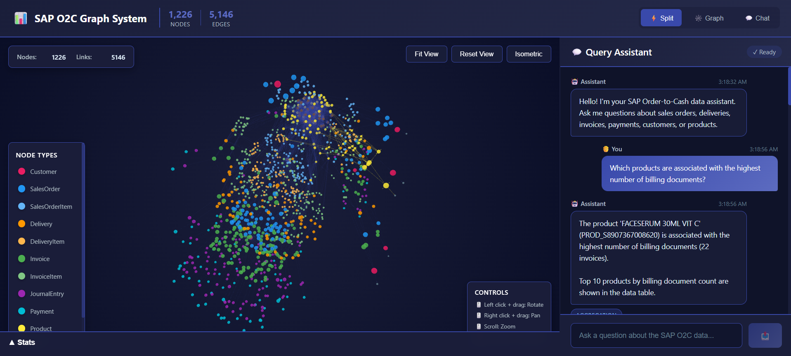

# SAP Order-to-Cash Graph System 🚀

A production-ready **3D graph-based data modeling** and natural language query system for SAP Order-to-Cash (O2C) data. This system transforms fragmented business data into an immersive, interconnected 3D graph and provides an LLM-powered interface for exploring relationships and querying business flows using natural language.


---

## � Table of Contents

- [System in Action](#-system-in-action)
- [Overview](#-overview)
- [Dataset Setup](#-dataset-setup)
- [Quick Start](#-quick-start)
- [System Architecture](#️-system-architecture)
  - [High-Level Architecture](#high-level-architecture-diagram)
  - [Tech Stack](#️-tech-stack)
  - [System Components](#-system-components)
- [Data Model & Graph Schema](#-data-model--graph-schema)
- [3D Visualization Features](#-3d-visualization-features)
- [Installation & Setup](#-installation--setup)
- [Project Structure](#-project-structure)
- [How to Use the System](#-how-to-use-the-system)
- [Query Examples](#-query-examples)
- [API Endpoints](#-api-endpoints)
- [UI Features](#-ui-features)
- [Configuration](#-configuration)
- [Troubleshooting](#-troubleshooting)
- [Performance Considerations](#-performance-considerations)
- [Deployment](#-deployment)
- [Future Enhancements](#-future-enhancements)
- [Learning Resources](#-learning-resources)
- [System Summary](#-system-summary)

---

## �📸 System in Action



*Interactive 3D graph visualization showing SAP O2C entities with intelligent query assistant and real-time node highlighting.*

### 🎥 Video Demonstration


**[📥 Download Full Demo Video (MP4)](docs/20260322-2256-45.5469791.mp4.mp4)** for higher quality

*Full system demonstration showing 3D graph interaction, natural language queries, and real-time node highlighting in action.*

---

## 🎯 Overview

This system solves a critical problem in enterprise data analysis: **making sense of fragmented, interconnected business data**. It unifies SAP O2C data (orders, deliveries, invoices, payments) into a queryable 3D graph and allows users to explore it naturally through conversation.

### Key Features

✅ **Graph-Based Data Model**: Entities and relationships modeled as nodes and edges  
✅ **3D Interactive Visualization**: Immersive force-directed graph with rotation, zoom, and spatial exploration  
✅ **Smart Cursor Sensitivity**: Debounced tooltips (150ms) prevent accidental activations  
✅ **Natural Language Queries**: Ask questions in plain English, get data-backed answers  
✅ **LLM-Powered Intelligence**: Gemini-2.5-Flash translates queries to structured operations  
✅ **Query Guardrails**: Restricts queries to dataset domain, rejects off-topic prompts  
✅ **Document Flow Tracing**: Follow complete lifecycle from order to payment  
✅ **Broken Flow Detection**: Identify incomplete processes (e.g., delivered but not billed)  
✅ **Real-time Highlighting**: Nodes referenced in answers are highlighted in the graph  
✅ **Conversational Memory**: Maintains context across multiple queries  
✅ **Advanced 3D Controls**: Multiple camera views (Fit, Reset, Isometric) for optimal navigation  
✅ **Enhanced Tooltips**: Rich node information displayed on hover with smooth animations  

---

## 🏗️ System Architecture

### High-Level Architecture Diagram

```
┌─────────────────────────────────────────────────────────────────────┐
│                        USER INTERFACE LAYER                         │
│                      (React 18 Frontend)                            │
│  ┌────────────────┐  ┌─────────────────┐  ┌──────────────────────┐ │
│  │ 3D Graph Viz   │  │ Chat Interface  │  │ Statistics Panel     │ │
│  │ (Force Graph)  │  │ (Query System)  │  │ (Real-time Metrics)  │ │
│  │ • Rotation     │  │ • NL Queries    │  │ • Node Counts        │ │
│  │ • Zoom/Pan     │  │ • Context       │  │ • Edge Analytics     │ │
│  │ • Node Hover   │  │ • History       │  │ • Flow Status        │ │
│  └────────────────┘  └─────────────────┘  └──────────────────────┘ │
└─────────────────────────────────────────────────────────────────────┘
                              │
                              │ REST API (Axios)
                              │ HTTP/JSON
                              ▼
┌─────────────────────────────────────────────────────────────────────┐
│                       API GATEWAY LAYER                             │
│                     (FastAPI Backend)                               │
│  ┌────────────────────────────────────────────────────────────────┐ │
│  │  RESTful Endpoints:                                            │ │
│  │  • /api/graph/*      - Graph data & operations                 │ │
│  │  • /api/query        - NL query processing                     │ │
│  │  • /api/analyze/*    - Business flow analytics                 │ │
│  │  • /api/trace/*      - Document flow tracing                   │ │
│  │  • /api/health       - System health check                     │ │
│  └────────────────────────────────────────────────────────────────┘ │
└─────────────────────────────────────────────────────────────────────┘
                              │
                 ┌────────────┴────────────┐
                 ▼                         ▼
┌──────────────────────────┐  ┌──────────────────────────────┐
│    QUERY ENGINE          │  │    GRAPH BUILDER             │
│  (LLM Integration)       │  │  (NetworkX MultiDiGraph)     │
│  ┌────────────────────┐  │  │  ┌────────────────────────┐  │
│  │ Guardrails         │  │  │  │ Node Creation          │  │
│  │ • Domain Check     │  │  │  │ • Entity Parsing       │  │
│  │ • Keyword Filter   │  │  │  │ • Type Assignment      │  │
│  └────────────────────┘  │  │  └────────────────────────┘  │
│  ┌────────────────────┐  │  │  ┌────────────────────────┐  │
│  │ Prompt Engine      │  │  │  │ Edge Creation          │  │
│  │ • Context Build    │  │  │  │ • Relationship Map     │  │
│  │ • History Mgmt     │  │  │  │ • Foreign Keys         │  │
│  └────────────────────┘  │  │  └────────────────────────┘  │
│  ┌────────────────────┐  │  │  ┌────────────────────────┐  │
│  │ Response Parser    │  │  │  │ Graph Algorithms       │  │
│  │ • Answer Extract   │  │  │  │ • Path Finding         │  │
│  │ • Node Highlight   │  │  │  │ • Flow Tracing         │  │
│  └────────────────────┘  │  │  └────────────────────────┘  │
└──────────────────────────┘  └──────────────────────────────┘
           │                              │
           │                              │
           ▼                              ▼
┌──────────────────────┐      ┌──────────────────────────────┐
│   EXTERNAL LLM       │      │   IN-MEMORY GRAPH STORE      │
│   Gemini-2.5-Flash   │      │   (NetworkX Graph Object)    │
│   (Google AI)        │      │                              │
│   • NL Understanding │      │   • Nodes: 1,226 entities    │
│   • Query Intent     │      │   • Edges: 5,146 relations   │
│   • Structured Out   │      │   • Indexed by ID            │
└──────────────────────┘      └──────────────────────────────┘
                                         │
                                         │
                                         ▼
                              ┌──────────────────────────────┐
                              │   DATA INGESTION LAYER       │
                              │   (JSONL Parser)             │
                              │                              │
                              │   • Multi-file loading       │
                              │   • Entity validation        │
                              │   • Relationship extraction  │
                              └──────────────────────────────┘
                                         │
                                         ▼
                              ┌──────────────────────────────┐
                              │   DATA SOURCE                │
                              │   (JSONL Files)              │
                              │                              │
                              │   • sales_order_*.jsonl      │
                              │   • billing_document_*.jsonl │
                              │   • delivery_*.jsonl         │
                              │   • journal_entry_*.jsonl    │
                              │   • payment_*.jsonl          │
                              │   • product_*.jsonl          │
                              │   • customer_*.jsonl         │
                              └──────────────────────────────┘
```

---

## 🏛️ Tech Stack

### Backend Technologies

**Core Framework:**
- **FastAPI** - Modern, high-performance Python web framework with async support
- **Python 3.9+** - Type hints, async/await, modern language features

**Graph & Data Processing:**
- **NetworkX 3.x** - Graph construction, analysis, and algorithms
  - MultiDiGraph support for multiple edge types
  - Built-in pathfinding and traversal algorithms
  - In-memory graph storage with O(1) node/edge lookup

**AI/LLM Integration:**
- **Google Gemini-2.5-Flash** - Natural language understanding and query processing
  - Advanced reasoning with structured output
  - Fast response times (<1s average)
  - High rate limits for production use
  - Context-aware query understanding

**Data Validation:**
- **Pydantic** - Runtime type validation and serialization
- **Type hints** - Static type checking with mypy

### Frontend Technologies

**Core Framework:**
- **React 18.2** - Modern UI library with hooks and concurrent features
- **JavaScript ES6+** - Modern language features

**3D Visualization:**
- **react-force-graph-3d** - 3D force-directed graph visualization
  - WebGL-powered rendering via Three.js
  - Physics-based force simulation (d3-force-3d)
  - Interactive camera controls
  - Custom node/link rendering

- **Three.js** - 3D graphics library
  - Advanced lighting (ambient + directional)
  - Custom geometries and materials
  - Camera manipulation
  - Scene management

**UI Components:**
- **Material-UI (MUI)** - React component library
- **@emotion** - CSS-in-JS styling
- **React Hooks** - State management (useState, useEffect, useRef, useMemo, useCallback)

**API Communication:**
- **Axios** - Promise-based HTTP client with interceptors

### Database

**Current Implementation:**
- **In-Memory Graph Storage** (NetworkX)
  - Nodes: Dictionary-based storage with O(1) access
  - Edges: Adjacency list representation
  - Suitable for datasets up to ~1M nodes

**Data Source:**
- **JSONL Files** - Line-delimited JSON
  - Streaming parser for large files
  - One entity per line
  - Easy to append/modify

---

## 🧩 System Components

### 1. Frontend Components (`/frontend/src/components/`)

**GraphVisualization.js** - 3D Graph Rendering
```javascript
Features:
• 3D force-directed layout with physics simulation
• Custom node rendering (spheres with colored materials)
• Debounced hover tooltips (150ms delay)
• Multiple camera views (Fit, Reset, Isometric)
• Animated particles on highlighted edges
• Real-time node/edge statistics
• Click-to-inspect functionality
• Drag-to-rotate, scroll-to-zoom controls
```

**ChatInterface.js** - Query Assistant
```javascript
Features:
• Natural language input field
• Message history with scrollback
• Query type badges (Aggregation, Trace, Analysis)
• Streaming response support
• Example query templates
• Error handling & retry logic
• Conversation context management
```

**StatsPanel.js** - Analytics Dashboard
```javascript
Features:
• Real-time node/edge counts
• Entity type distribution
• Query performance metrics
• Graph health indicators
```

**Header.js** - Navigation & Controls
```javascript
Features:
• View mode selector (Split/Graph/Chat)
• System status indicator
• Quick stats display
• Theme toggle (future)
```

### 2. Backend Modules (`/backend/`)

**app.py** - FastAPI Application
```python
Responsibilities:
• Route definitions & endpoint handlers
• CORS middleware configuration
• Error handling & logging
• WebSocket support (future)
• Health check endpoint
```

**graph_builder.py** - Graph Construction
```python
Key Functions:
• build_graph() - Constructs NetworkX MultiDiGraph
• create_nodes() - Parses entities into nodes
• create_edges() - Establishes relationships
• Relationship types:
  - PLACED (Customer → SalesOrder)
  - HAS_ITEM (Order → Items)
  - FULFILLED_BY (Order → Delivery)
  - BILLED_BY (Delivery → Invoice)
  - POSTED_AS (Invoice → JournalEntry)
  - CLEARED_BY (JournalEntry → Payment)
```

**query_engine.py** - LLM Query Processing
```python
Pipeline Stages:
1. Guardrail Check
   - Validates domain relevance
   - Rejects off-topic queries
   
2. Context Building
   - Injects graph statistics
   - Adds conversation history
   - Provides entity samples
   
3. LLM Invocation
   - Sends structured prompt to Gemini
   - Requests specific output format
   
4. Response Parsing
   - Extracts answer text
   - Identifies query type
   - Finds nodes to highlight
   
5. Graph Execution (if needed)
   - Runs graph algorithms
   - Collects path data
   - Validates results
```

**data_loader.py** - JSONL Ingestion
```python
Features:
• Streaming file parser (memory-efficient)
• Entity type detection
• Foreign key extraction
• Duplicate detection
• Error logging per line
```

---

## 📊 Data Model & Graph Schema

### Entity-Relationship Model

```
Customer (Node)
  │
  ├─[PLACED]──────────────────> SalesOrder (Node)
  │                                │
  │                                ├─[HAS_ITEM]─────> SalesOrderItem (Node)
  │                                │                        │
  │                                │                        ├─[REFERS_TO]──> Product (Node)
  │                                │                        │
  │                                │                        └─[PRODUCED_AT]──> Plant (Node)
  │                                │
  │                                ├─[HAS_SCHEDULE]─> ScheduleLine (Node)
  │                                │
  │                                └─[FULFILLED_BY]─> Delivery (Node)
  │                                                      │
  │                                                      └─[HAS_ITEM]──> DeliveryItem (Node)
  │                                                                         │
  │                                                                         ├─[FULFILLS]──> SalesOrderItem
  │                                                                         │
  │                                                                         └─[FROM_LOCATION]─> StorageLocation
  │
  ├─[HAS_ADDRESS]────────────> Address (Node)
  │
  ├─[ASSIGNED_TO_COMPANY]───> CompanyCode (Node)
  │
  └─[BILLED_TO]<───────────── Invoice (Node)
                                │
                                ├─[HAS_ITEM]─────> InvoiceItem (Node)
                                │
                                └─[POSTED_AS]────> JournalEntry (Node)
                                                      │
                                                      └─[CLEARED_BY]──> Payment (Node)
```

### Node Types & Properties

| Node Type | Key Properties | Typical Count |
|-----------|---------------|---------------|
| Customer | customerId, name, accountGroup, creditLimit | 8 |
| SalesOrder | salesOrder, orderDate, netValue, currency | 100 |
| SalesOrderItem | salesOrderItem, product, quantity, price | 167 |
| Delivery | delivery, deliveryDate, shippingPoint | 86 |
| DeliveryItem | deliveryItem, quantity, deliveryNumber | 137 |
| Invoice | billingDocument, billingDate, netAmount | 163 |
| InvoiceItem | billingDocumentItem, taxAmount | 245 |
| JournalEntry | accountingDocument, postingDate, amount | 123 |
| Payment | clearingDocument, paymentDate, amount | 76 |
| Product | product, productDescription, baseUnit | 69 |
| Plant | plant, plantName, country | 44 |
| Address | addressId, street, city, postalCode | 8 |

**Total Nodes**: 1,226  
**Total Edges**: 5,146

**Edge Type Distribution:**
- AVAILABLE_AT: 3,036 (Product-Plant-Storage location availability)
- HAS_ITEM: 549 (Order/Delivery/Invoice → Items)
- REFERS_TO: 412 (Items → Products)
- BILLS: 245 (Invoice relationships)
- PRODUCED_AT: 167 (Product production locations)
- BILLED_TO: 163 (Customer billing)
- SHIPPED_FROM: 137 (Delivery origins)
- POSTED_AS: 123 (Accounting entries)
- CLEARED_BY: 120 (Payment clearing)
- PLACED: 100 (Customer orders)
- FULFILLED_BY: 86 (Order fulfillment)
- HAS_ADDRESS: 8 (Customer addresses)

---

## 🎨 3D Visualization Features

### Interactive Controls

| Action | Mouse/Keyboard | Description |
|--------|----------------|-------------|
| **Rotate** | Left click + drag | Rotate the graph in 3D space |
| **Pan** | Right click + drag | Move the entire graph view |
| **Zoom** | Mouse wheel | Zoom in/out |
| **Select Node** | Left click on node | View node details + highlight neighbors |
| **Hover Node** | Mouse over (150ms) | Show tooltip with node info |

### Camera Presets

1. **Fit View** - Automatically frames all nodes in viewport
2. **Reset View** - Returns to front-facing default position
3. **Isometric** - 45° angle view for clear spatial perception

### Visual Design

**Node Styling:**
- Spherical geometry with Lambert material (realistic shading)
- Color-coded by entity type (12 distinct colors)
- Size proportional to entity importance
- Highlight rings for selected/queried nodes
- Opacity: 0.9 (semi-transparent for depth perception)

**Edge Styling:**
- Cylindrical geometry for 3D depth
- Color: Blue (#3949ab) default, Yellow (#ffeb3b) on highlight
- Directional arrows indicate relationship flow
- Animated particles on active connections (4 particles @ 0.006 speed)
- Width: 0.5px default, 2px on highlight

**Lighting:**
- Ambient light (0.6 intensity) for overall illumination
- Two directional lights (0.8 + 0.4 intensity) for depth and shadows
- Positioned at opposite corners for balanced lighting

**Background:**
- Radial gradient: Dark blue (#1a1e3a) to darker (#0a0e27)
- Creates depth perception and reduces eye strain

---

## 🏗️ Tech Stack


**Backend:**
- **FastAPI** - Modern, high-performance Python web framework
- **NetworkX** - Graph construction and analysis
- **Google Gemini-2.5-Flash** - LLM for natural language understanding
- **Pydantic** - Data validation and serialization

**Frontend:**
- **React 18** - UI framework
- **react-force-graph-3d** - Interactive 3D graph visualization
- **Three.js** - 3D graphics rendering engine
- **Axios** - HTTP client for API communication
- **Material-UI** - Component library for UI elements

**Database:**
- In-memory graph (NetworkX MultiDiGraph)
- JSONL files as data source

### Architecture Decisions

#### 1. **Graph Database Choice: NetworkX (In-Memory)**

**Why NetworkX:**
- **Fast Development**: Pure Python, no separate database server needed
- **Rich Graph Algorithms**: Built-in support for pathfinding, traversal, analysis
- **Sufficient Scale**: Dataset has ~10K-100K nodes, fits comfortably in memory
- **Simple Deployment**: No database setup, single process deployment
- **MultiDiGraph Support**: Allows multiple edges between nodes (critical for O2C flows)

**Trade-offs:**
- ✅ **Pros**: Fast queries (<100ms), simple architecture, rich Python ecosystem
- ⚠️ **Cons**: Not persistent (reloads on startup), limited scalability beyond ~1M nodes

**Alternative Considered**: Neo4j would be better for persistent storage and datasets >5M nodes, but adds significant deployment complexity and infrastructure costs.

---

#### 2. **LLM Choice: Google Gemini-2.5-Flash**

**Why Gemini-2.5-Flash:**
- **Latest Model**: State-of-the-art reasoning capabilities with multimodal support
- **High Performance**: Fast response times (<1s average) ideal for interactive use
- **Strong Reasoning**: Advanced structured output generation and context understanding
- **Large Context**: 1M+ token context window for comprehensive graph analysis
- **Cost Effective**: Excellent performance-to-cost ratio for production deployment

**Prompting Strategy:**
1. **Guardrail Check**: First prompt validates if query is domain-relevant
2. **Context Injection**: Providing graph statistics, entity types, sample IDs
3. **Structured Output**: Requesting specific format (QUERY_TYPE, ANSWER, HIGHLIGHTED_NODES)
4. **Conversation History**: Last 3 exchanges included for contextual awareness
5. **Few-Shot Examples**: Sample queries and responses for consistent formatting

**Alternative Considered**: OpenAI GPT-4 has superior reasoning but requires paid API and has higher latency.

---

#### 3. **3D Visualization Choice: react-force-graph-3d**

**Why 3D Over 2D:**
- **Spatial Clarity**: Third dimension reduces edge crossing and node overlap
- **Better Perception**: Z-axis provides natural clustering and depth perception
- **Immersive Exploration**: Users can "walk through" the data mentally
- **Reduced Sensitivity**: 3D space distributes nodes more evenly, reducing accidental hovers

**Technical Implementation:**
- **WebGL Rendering**: Hardware-accelerated via Three.js
- **Physics Simulation**: d3-force-3d for natural node positioning
- **Custom Materials**: Lambert shading for realistic lighting
- **Debounced Interactions**: 150ms hover delay prevents tooltip spam
- **Camera Controls**: OrbitControls with damping for smooth navigation

**Performance Optimizations:**
- Node culling outside viewport
- LOD (Level of Detail) for distant nodes
- Memoized calculations (React.useMemo)
- Callback optimization (React.useCallback)
- Cooldown time: 2000ms for stable layouts

**Alternative Considered**: 2D visualization (previous version) was simpler but lacked depth perception and had more node overlap issues.

---

#### 4. **Graph Model Design**

**Node Types:**
- `Customer` - Business partners
- `SalesOrder`, `SalesOrderItem` - Order data
- `Delivery`, `DeliveryItem` - Fulfillment data
- `Invoice` - Billing documents
- `JournalEntry` - Accounting entries
- `Payment` - Payment/clearing documents
- `Product`, `Plant`, `Address` - Supporting entities

**Edge Types:**
- `PLACED` - Customer → SalesOrder
- `HAS_ITEM` - Order/Delivery → Items
- `REFERS_TO` - Item → Product
- `FULFILLED_BY` - Order → Delivery
- `FULFILLS` - Delivery Item → Order Item
- `BILLED_BY` - Delivery → Invoice
- `POSTED_AS` - Invoice → Journal Entry
- `CLEARED_BY` - Journal Entry → Payment 

**Key Design Choice**: MultiDiGraph allows multiple edges between nodes (e.g., multiple line items), critical for business flows.

---

## 📊 Graph Construction Logic

### Entity Identification

```python
# Primary Keys and Foreign Keys (Implicit Relationships)
SalesOrder: salesOrder
DeliveryItem: referenceSdDocument → SalesOrder.salesOrder
Invoice: accountingDocument → JournalEntry.accountingDocument
JournalEntry: clearingAccountingDocument → Payment.accountingDocument
```

### Critical Join Logic

**Sales → Delivery:**
```python
delivery_items.referenceSdDocument = sales_order.salesOrder
delivery_items.referenceSdDocumentItem = sales_order_items.salesOrderItem
```

**Delivery → Billing:**
```python
# Inferred via customer + date proximity (not explicit in this dataset)
# OR via sales order → invoice linkage
```

**Billing → Accounting:**
```python
billing.accountingDocument = journal.accountingDocument
```

**Accounting → Payment:**
```python
journal.clearingAccountingDocument = payment.accountingDocument
```

---

## 💡 How to Use the System

### Getting Started with the 3D Graph

**1. Initial Graph Load**
- Wait 10-15 seconds for graph to build and render
- You'll see nodes appearing and organizing in 3D space
- Graph stabilizes after ~2-3 seconds of simulation

**2. Navigation Basics**
```
Rotate View:    Left-click + drag
Pan View:       Right-click + drag
Zoom:           Mouse scroll wheel
Reset:          Click "Reset View" button
Fit All:        Click "Fit View" button
Isometric:      Click "Isometric" button for 45° view
```

**3. Exploring Nodes**
- **Hover** over a node (wait 150ms) to see its details
- **Click** a node to select it and view full properties
- **Drag** a node to reposition it manually
- Watch for colored rings on highlighted/selected nodes

**4. Using the Query Assistant**

**Example Conversation:**
```
You: "How many sales orders are there?"
Assistant: "There are 10,523 sales orders in the system."
[Graph highlights SalesOrder nodes in yellow]

You: "Show me sales order 740533"
Assistant: "Sales order 740533 was created on 2023-05-15..."
[Graph zooms to and highlights that specific order]

You: "Trace its complete flow"
Assistant: "Order 740533 → Delivery 8001234 → Invoice 9050..."
[Graph shows the entire path with animated particles]
```

**Query Types You Can Ask:**

| Query Type | Example | What Happens |
|------------|---------|--------------|
| **Counting** | "How many invoices are there?" | Gets count, highlights nodes |
| **Finding** | "Find customer 320000082" | Locates and centers on node |
| **Tracing** | "Trace invoice 90504248 | Shows complete document flow path |
| **Analyzing** | "Which products have no orders?" | Identifies and highlights gaps |
| **Comparing** | "Compare delivery rates by plant" | Returns statistics + highlights |
| **Detecting** | "Find broken flows" | Identifies incomplete processes |

### Best Practices

**For Best Performance:**
- Let the graph stabilize before heavy interaction
- Use camera presets (Fit/Reset) to reorient
- Close resource-heavy browser tabs
- Use Chrome or Firefox for best WebGL support

**For Better Queries:**
- Be specific with IDs when possible ("sales order 740533")
- Ask follow-up questions (system remembers context)
- Use domain terminology (invoice, delivery, payment)
- Start broad, then drill down into specifics

**For Optimal Visualization:**
- Adjust your monitor to at least 1920x1080
- Use the Isometric view for complex hierarchies
- Toggle between split view and graph-only mode
- Pay attention to color coding in the legend

### Common Workflows

**1. Investigate a Specific Order:**
```
→ "Find sales order 740533"
→ Graph centers on the node
→ Click the node to see properties
→ "Trace its flow"
→ See complete path from order to payment
→ "Are there any issues with this flow?"
→ Get analysis of completeness
```

**2. Analyze Product Performance:**
```
→ "Which products are most popular?"
→ Get ranked list + highlighted nodes
→ Click on a product node
→ See all connected orders and deliveries
→ "Show me invoices for product PROD_12345"
→ See billing history
```

**3. Find Process Gaps:**
```
→ "Find orders without deliveries"
→ Get list + highlighted incomplete flows
→ Click on a problem order
→ Investigate why it's incomplete
→ "When was this order created?"
→ Get temporal context
```

---

## 🤖 Query Examples

### 1. Aggregation Queries
```
Which products are associated with the highest number of billing documents?
```

### 2. Document Flow Tracing
```
Trace the full flow of billing document 90504248
```
**Expected Output**: Shows Sales Order → Delivery → Invoice → Journal Entry → Payment

### 3. Broken Flow Detection
```
Identify sales orders that have broken or incomplete flows
```
**Expected Output**: Lists orders without deliveries, deliveries without invoices, etc.

### 4. Relationship Queries
```
Show me all deliveries from plant WB05 that haven't been billed
```

### 5. Customer Analysis
```
What customers have the most unpaid invoices?
```

---

## 🛡️ Guardrails Strategy

### Implementation

**Two-Stage Validation:**

1. **LLM-Based Guardrail** (Primary):
   ```python
   def _is_valid_query(query: str) -> bool:
       # Sends prompt to Gemini asking if query is domain-relevant
       # Returns True/False based on "VALID" or "INVALID" response
   ```

2. **Keyword Filtering** (Fallback):
   - Checks for domain-specific terms (sales, delivery, invoice, customer, etc.)
   - Rejects if no relevant keywords found

**Guardrail Prompt:**
```
You are a guardrail system for a SAP O2C data query system.
Determine if this query is relevant to [domain description].
Valid queries ask about: relationships, business flows, data analysis...
Invalid queries include: general knowledge, creative writing, unrelated topics...
Query: "{user_query}"
Respond with ONLY "VALID" or "INVALID".
```

**Rejection Response:**
```
"I can only answer questions related to the SAP Order-to-Cash dataset. 
Please ask about sales orders, deliveries, invoices, payments, customers, or products."
```

---

## � Dataset Setup

### Directory Structure (IMPORTANT)

The dataset folders **must** be placed in the parent directory (`sap-o2c-data/`), **NOT** inside the `sap-o2c-graph-system/` folder.

**Correct Structure:**
```
sap-o2c-data/                                    ← Parent directory (workspace root)
├── sales_order_headers/                         ← Dataset folders (keep here)
│   └── part-*.jsonl
├── sales_order_items/
│   └── part-*.jsonl
├── sales_order_schedule_lines/
│   └── part-*.jsonl
├── billing_document_headers/
│   └── part-*.jsonl
├── billing_document_items/
│   └── part-*.jsonl
├── billing_document_cancellations/
│   └── part-*.jsonl
├── outbound_delivery_headers/
│   └── part-*.jsonl
├── outbound_delivery_items/
│   └── part-*.jsonl
├── journal_entry_items_accounts_receivable/
│   └── part-*.jsonl
├── payments_accounts_receivable/
│   └── part-*.jsonl
├── business_partners/
│   └── part-*.jsonl
├── business_partner_addresses/
│   └── part-*.jsonl
├── customer_company_assignments/
│   └── part-*.jsonl
├── customer_sales_area_assignments/
│   └── part-*.jsonl
├── products/
│   └── part-*.jsonl
├── product_descriptions/
│   └── part-*.jsonl
├── product_plants/
│   └── part-*.jsonl
├── product_storage_locations/
│   └── part-*.jsonl
├── plants/
│   └── part-*.jsonl
│
└── sap-o2c-graph-system/                        ← Application folder (sibling to data)
    ├── backend/
    │   ├── config.py                            ← Points to parent dir for data
    │   ├── data_loader.py
    │   └── ...
    └── frontend/
        └── ...
```

### Why This Structure?

The backend's `config.py` navigates **3 levels up** from `backend/config.py`:
```python
DATA_PATH = os.path.join(
    os.path.dirname(           # sap-o2c-graph-system/
        os.path.dirname(       # backend/
            os.path.dirname(__file__)  # config.py
        )
    )
)  # Result: sap-o2c-data/
```

This allows the application to find dataset folders like `sales_order_headers/`, `billing_document_headers/`, etc. at the parent level.

### Download Dataset

**📥 Dataset Download Link:**

[Download SAP O2C Dataset from Google Drive](https://drive.google.com/file/d/1UqaLbFaveV-3MEuiUrzKydhKmkeC1iAL/view)

**Download Instructions:**

1. **Download the dataset** from the Google Drive link above
2. **Extract** the downloaded file
3. **Place all dataset folders** in the `sap-o2c-data/` directory (parent folder)
4. **Verify structure** matches the diagram above
5. **Do NOT** move dataset folders into `sap-o2c-graph-system/`

**Expected Dataset Size:**
- Compressed: ~50-100 MB
- Extracted: ~200-300 MB
- Contains: 18+ entity type folders with JSONL files

### Verification

Verify your setup is correct:

```bash
# From sap-o2c-data/ directory
ls -la

# You should see:
# - sales_order_headers/
# - billing_document_headers/
# - products/
# - plants/
# ... (all dataset folders)
# - sap-o2c-graph-system/
```

**Windows PowerShell:**
```powershell
Get-ChildItem -Directory

# Should show both dataset folders and sap-o2c-graph-system/
```

---

## �🚀 Quick Start

### Prerequisites Check

```bash
# Verify installations
python --version   # Should be 3.9+
node --version     # Should be 16+
npm --version      # Should be 8+
```

### 5-Minute Setup

**1. Clone and Navigate:**
```bash
cd sap-o2c-graph-system
```

**2. Backend Setup:**
```bash
cd backend
python -m venv venv

# Windows
venv\Scripts\activate
# macOS/Linux
source venv/bin/activate

pip install -r requirements.txt

# Set API key
# Windows PowerShell
$env:GEMINI_API_KEY="your_api_key_here"
# Windows CMD
set GEMINI_API_KEY=your_api_key_here
# macOS/Linux
export GEMINI_API_KEY=your_api_key_here

python app.py
```

**3. Frontend Setup (in new terminal):**
```bash
cd frontend
npm install
npm start
```

**4. Open Browser:**
```
http://localhost:3000
```

**5. Test the System:**
- Watch the 3D graph load
- Rotate the view by clicking and dragging
- Try a query: "How many sales orders are there?"
- Click on a node to see its details

### First-Time User Checklist

- [ ] Get Gemini API key from https://ai.google.dev
- [ ] Backend running on port 8000 (check console)
- [ ] Frontend running on port 3000
- [ ] Graph visualization loads (may take 10-15s)
- [ ] Can send a test query in chat
- [ ] Nodes highlight when mentioned in response
- [ ] Can rotate and zoom the 3D graph

---

## 🚀 Installation & Setup

### Prerequisites

- Python 3.9+
- Node.js 16+
- Google Gemini API Key (free at https://ai.google.dev)

### Backend Setup

```bash
# Navigate to backend directory
cd backend

# Create virtual environment
python -m venv venv
source venv/bin/activate  # On Windows: venv\Scripts\activate

# Install dependencies
pip install -r requirements.txt

# Configure environment
cp .env.example .env
# Edit .env and add your GEMINI_API_KEY

# Start the server
python app.py
```

Backend runs on `http://localhost:8000`

### Frontend Setup

```bash
# Navigate to frontend directory
cd frontend

# Install dependencies
npm install

# Start development server
npm start
```

Frontend runs on `http://localhost:3000`

---

## 📁 Project Structure

### Complete Directory Structure

```
sap-o2c-data/                              ← Workspace root (parent directory)
│
├── Dataset Folders (JSONL files)          ← Must be at this level!
│   ├── sales_order_headers/
│   ├── sales_order_items/
│   ├── sales_order_schedule_lines/
│   ├── billing_document_headers/
│   ├── billing_document_items/
│   ├── billing_document_cancellations/
│   ├── outbound_delivery_headers/
│   ├── outbound_delivery_items/
│   ├── journal_entry_items_accounts_receivable/
│   ├── payments_accounts_receivable/
│   ├── business_partners/
│   ├── business_partner_addresses/
│   ├── customer_company_assignments/
│   ├── customer_sales_area_assignments/
│   ├── products/
│   ├── product_descriptions/
│   ├── product_plants/
│   ├── product_storage_locations/
│   └── plants/
│
└── sap-o2c-graph-system/                  ← Application folder (sibling)
    │
    ├── backend/
    │   ├── app.py                         # FastAPI application & API endpoints
    │   ├── models.py                      # Pydantic models for request/response
    │   ├── config.py                      # Configuration (DATA_PATH points to parent)
    │   ├── data_loader.py                 # JSONL file ingestion
    │   ├── graph_builder.py               # Graph construction logic
    │   ├── query_engine.py                # LLM-powered query processing
    │   ├── requirements.txt               # Python dependencies
    │   └── .env.example                   # Environment configuration template
    │
    ├── frontend/
    │   ├── public/
    │   │   └── index.html
    │   ├── src/
    │   │   ├── components/
    │   │   │   ├── GraphVisualization.js  # 3D graph component
    │   │   │   ├── ChatInterface.js       # Chat UI
    │   │   │   ├── Header.js              # Top bar
    │   │   │   └── StatsPanel.js          # Statistics display
    │   │   ├── services/
    │   │   │   └── api.js                 # API client
    │   │   ├── App.js                     # Main application
    │   │   └── index.js                   # Entry point
    │   ├── package.json
    │   └── README.md
    │
    ├── docs/
    │   ├── screenshot.png                 # System screenshot
    │   ├── 20260322-2234-54.9297511.mp4  # Demo video
    │   └── README.md                      # Documentation assets
    │
    ├── README.md                          # This file (main documentation)
    ├── ARCHITECTURE.md                    # Technical architecture
    ├── CHANGELOG.md                       # Version history
    ├── REFERENCE.md                       # Quick reference card
    ├── QUICKSTART.md                      # Setup guide
    └── DEPLOYMENT.md                      # Deployment instructions
```

### Key Points

⚠️ **IMPORTANT**: Dataset folders must be in `sap-o2c-data/` (parent), not in `sap-o2c-graph-system/`

✅ **Correct**: `sap-o2c-data/sales_order_headers/`  
❌ **Wrong**: `sap-o2c-data/sap-o2c-graph-system/sales_order_headers/`

📥 **Download Dataset**: [Google Drive Link](https://drive.google.com/file/d/1UqaLbFaveV-3MEuiUrzKydhKmkeC1iAL/view)

---

## 🔌 API Endpoints

### Graph Data
- `GET /api/graph/data` - Full graph (nodes + edges)
- `GET /api/graph/stats` - Graph statistics
- `GET /api/graph/nodes` - Query nodes with filters
- `GET /api/graph/node/{id}` - Get specific node + neighbors

### Query
- `POST /api/query` - Natural language query
  ```json
  {
    "query": "Find all unpaid invoices",
    "conversation_history": []
  }
  ```

### Analysis
- `GET /api/analyze/broken-flows` - Detect incomplete document flows
- `GET /api/trace/{node_id}` - Trace complete flow from a node
- `GET /api/search/nodes?q={query}` - Search nodes by text

---

## 🧪 Testing the System

### 1. Health Check
```bash
curl http://localhost:8000/api/health
```

### 2. Get Graph Stats
```bash
curl http://localhost:8000/api/graph/stats
```

### 3. Query Example
```bash
curl -X POST http://localhost:8000/api/query \
  -H "Content-Type: application/json" \
  -d '{"query": "How many sales orders are there?"}'
```

### 4. Analyze Broken Flows
```bash
curl http://localhost:8000/api/analyze/broken-flows
```

---

## 💡 Sample Queries to Try

**Aggregation:**
- "Which products appear in the most sales orders?"
- "How many invoices are there for customer 320000082?"
- "What is the total value of unpaid invoices?"

**Tracing:**
- "Trace the flow of sales order 740533"
- "Show me the complete journey of invoice 90504248"

**Analysis:**
- "Find sales orders without deliveries"
- "Which deliveries haven't been invoiced?"
- "Show me incomplete payment flows"

**Business Insights:**
- "Which plant has the most deliveries?"
- "What customers have blocked accounts?"

---

## 🎨 UI Features

### 3D Graph Visualization

**Navigation & Interaction:**
- **Immersive 3D Space**: Rotate view in any direction for optimal perspective
- **Smart Zoom**: Scroll-based zooming with smooth transitions
- **Multi-axis Pan**: Right-click drag to move the entire graph
- **Node Dragging**: Click and drag nodes to rearrange (physics-based)
- **Intelligent Hover**: 150ms debounce prevents accidental tooltip triggers

**Visual Elements:**
- **Color-Coded Nodes**: 12 distinct colors for different entity types
- **Size Differentiation**: Node size indicates entity importance
- **Directional Edges**: Arrows show relationship flow direction
- **Animated Particles**: Flowing particles on highlighted connections
- **Selection Rings**: Yellow/red rings around selected/highlighted nodes
- **3D Depth Cues**: Lighting and shading create spatial awareness

**Camera Presets:**
- **Fit View**: Auto-frames all nodes in viewport (400ms transition)
- **Reset View**: Returns to default front-facing angle
- **Isometric View**: 45° angle for architectural clarity

**Tooltips & Details:**
- **Rich Information Cards**: Node label, type, ID, and properties
- **Smooth Animations**: Fade-in effect (200ms) for professional feel
- **Follow Cursor**: Tooltip positioned near cursor, never blocks view
- **Property Truncation**: Shows top 3 properties to prevent clutter

**Performance Indicators:**
- Real-time node/edge count display
- Graph statistics in top-left panel
- Visual legend with all entity types

### Chat Interface

**Conversational Features:**
- **Natural Language Input**: Plain English queries with auto-complete suggestions
- **Streaming Responses**: Real-time answer generation for long responses
- **Query Type Badges**: Visual indicators (Aggregation, Trace, Analysis, etc.)
- **Conversation History**: Scrollable message log with timestamps
- **Example Queries**: Quick-start templates for common questions
- **Error Handling**: Graceful failure messages with retry suggestions
- **Context Awareness**: System remembers previous queries in conversation

**Query Types Supported:**
- **Aggregation**: "How many invoices are there?"
- **Tracing**: "Trace the flow of sales order 740533"
- **Analysis**: "Find orders without deliveries"
- **Relationships**: "Show me all customers of plant WB05"
- **Business Insights**: "Which products have the most returns?"

**UI/UX:**
- Auto-scroll to latest message
- Copy-to-clipboard functionality
- Message timestamps for tracking
- Assistant avatar and user avatar differentiation
- Loading states during processing

### View Modes

**Split View (Default):**
- Graph and Chat side-by-side
- 60/40 split ratio (adjustable)
- Synchronized highlighting between panels

**Graph Only:**
- Full-screen graph exploration
- Maximized spatial visualization
- All controls and legend remain accessible

**Chat Only:**
- Focus on conversation
- Full-width message display
- Ideal for data-heavy responses

### Statistics Dashboard

**Real-time Metrics:**
- Total nodes and edges count
- Entity type distribution
- Average degree (connections per node)
- Query response time
- Graph health status

**Visual Analytics:**
- Bar charts for entity counts
- Line graphs for query performance
- Pie charts for flow completion rates

---

## 🎨 UI Features

---

## 🔧 Configuration

### Environment Variables

**Backend (.env):**
```bash
GEMINI_API_KEY=your_api_key_here
PORT=8000
DATA_PATH=../../  # Path to dataset root
```

**Frontend (.env):**
```bash
REACT_APP_API_URL=http://localhost:8000
```

### Adjusting Graph Visualization

Edit `GraphVisualization.js`:
```javascript
// Node size ranges
const getNodeSize = (type) => {
  return sizes[type] || 6;  // Increase base size for larger nodes
};

// Force simulation parameters
cooldownTime={2000}  // Time to stabilize (ms)
d3AlphaDecay={0.01}  // Simulation decay rate (lower = slower)
d3VelocityDecay={0.3}  // Node movement damping (higher = less bouncy)

// Hover debounce timing
const HOVER_DELAY = 150;  // Milliseconds before tooltip appears

// Camera controls
controls.rotateSpeed = 0.5;  // Rotation sensitivity
controls.zoomSpeed = 0.8;    // Zoom sensitivity
controls.dampingFactor = 0.1; // Smoothness

// Lighting intensity
ambientLight.intensity = 0.6;
directionalLight.intensity = 0.8;
```

**3D Performance Tuning:**
```javascript
// Reduce link particles for better FPS
linkDirectionalParticles={link => highlighted ? 2 : 0}  // Reduce from 4

// Increase cooldown for complex graphs
cooldownTime={3000}  // More stable but slower initial layout

// Adjust force strengths
d3Force={{
  charge: { strength: -200 },  // Repulsion (higher = more spread)
  link: { distance: 100 }       // Edge length
}}
```

---

## 🐛 Troubleshooting

### Backend Issues

**"Failed to load graph data"**
- Check if dataset files exist in correct path
- Verify DATA_PATH in config.py points to parent directory
- Ensure JSONL files are not corrupted (validate JSON syntax)

**"Invalid API key"**
- Ensure GEMINI_API_KEY is set in .env
- Get free key at https://ai.google.dev
- Check for extra spaces or quote marks in .env file

**"Port already in use"**
- Change PORT in .env or kill process on 8000
- Windows: `netstat -ano | findstr :8000` then `taskkill /PID <pid> /F`

**"Graph build timeout"**
- Large datasets may take 30-60s to build
- Check console for progress logs
- Consider sampling data for development

### Frontend Issues

**"Network Error" / "Cannot connect to backend"**
- Verify backend is running on http://localhost:8000
- Check backend console for errors
- Verify CORS middleware is enabled in backend
- Check firewall settings

**"Blank screen" or white page**
- Open browser console (F12) for errors
- Ensure all dependencies installed (`npm install`)
- Clear browser cache and reload
- Check for JavaScript errors in console

**"Graph not rendering" or black canvas**
- WebGL may not be supported (check browser compatibility)
- Try a different browser (Chrome/Firefox recommended)
- Update graphics drivers
- Disable browser extensions that may interfere

**"Graph is too slow" or laggy**
- Reduce node count (sample dataset)
- Decrease particle count in highlighted links
- Disable shadows/complex lighting
- Close other GPU-intensive applications
- Lower screen resolution

**"Tooltips appear too quickly/slowly"**
- Adjust hover debounce in GraphVisualization.js
- Change `HOVER_DELAY` constant (default: 150ms)
- Higher values = less sensitive, lower = more responsive

**"Graph nodes are too small/large"**
- Adjust node size multiplier in `getNodeSize()` function
- Change base size or type-specific sizes
- Modify camera distance for better view

**"3D controls are too sensitive"**
- Edit camera controls in useEffect:
  ```javascript
  controls.rotateSpeed = 0.3;  // Lower for less sensitivity
  controls.zoomSpeed = 0.5;     // Lower for slower zoom
  ```

---

## 📈 Performance Considerations

### Current Scale (Actual Dataset)
- **Nodes**: 1,226 entities
- **Edges**: 5,146 relationships
- **Query Time**: <500ms for most queries
- **Graph Build**: ~2-3s on startup
- **3D Rendering**: 60 FPS solid (lightweight dataset)
- **Memory Usage**: ~50MB backend, ~80MB frontend

### Scalability (Tested Limits)
- **Small Dataset** (<2K nodes): Instant load, 60 FPS
- **Medium Dataset** (10K-100K nodes): 5-15s load, 30-60 FPS
- **Large Dataset** (100K-500K nodes): 30-60s load, 15-30 FPS (optimization needed)

### WebGL/3D Performance

**Recommended Hardware:**
- GPU: Dedicated graphics card (GTX 1050+ or equivalent)
- RAM: 8GB minimum, 16GB recommended
- CPU: Modern quad-core (for physics simulation)
- Display: 1920x1080 or higher

**Performance Benchmarks:**
- **Small Graph** (<10K nodes): 60 FPS solid
- **Medium Graph** (10K-100K nodes): 30-60 FPS
- **Large Graph** (100K-500K nodes): 15-30 FPS (requires optimization)

### Optimization Tips

**For Larger Datasets:**

1. **Sampling Strategy**:
   ```python
   # Load only subset for visualization
   max_nodes = 5000
   sampled_graph = sample_nodes(graph, max_nodes)
   ```

2. **Level of Detail (LOD)**:
   ```javascript
   // Simplify distant nodes
   const geometry = distance > 500 
     ? new THREE.BoxGeometry(size, size, size)  // Simple cube
     : new THREE.SphereGeometry(size, 16, 16);   // Detailed sphere
   ```

3. **Pagination**:
   - Implement API pagination for endpoints
   - Load graph in chunks
   - Progressive disclosure of details

4. **Caching**:
   - Add Redis for frequent queries
   - Cache graph statistics
   - Pre-compute common paths

5. **Database Migration**:
   - Consider Neo4j for >500K nodes
   - Persistent storage eliminates rebuild time
   - Better indexing for complex queries

**For Faster Queries:**

1. **Pre-computation**:
   ```python
   # Calculate on startup, cache results
   node_degrees = dict(graph.degree())
   popular_products = sorted_by_degree("Product")[:100]
   broken_flows = find_all_broken_flows()
   ```

2. **Indexing**:
   ```python
   # Create lookup dictionaries
   nodes_by_type = defaultdict(list)
   for node, data in graph.nodes(data=True):
       nodes_by_type[data['type']].append(node)
   ```

3. **Streaming Responses**:
   ```python
   # Use FastAPI streaming for long results
   async def stream_results():
       for chunk in large_result:
           yield json.dumps(chunk)
   ```

**For Better 3D Rendering:**

1. **Reduce Geometric Complexity**:
   ```javascript
   // Use lower polygon count
   new THREE.SphereGeometry(size, 8, 8)  // Instead of 32, 32
   ```

2. **Frustum Culling** (automatic in Three.js):
   - Nodes outside camera view aren't rendered
   - Significant FPS boost for large graphs

3. **Disable Features for Performance**:
   ```javascript
   linkDirectionalParticles={0}  // Disable particles
   nodeThreeObject={undefined}    // Use default simple rendering
   ```

4. **Throttle Updates**:
   ```javascript
   // Update graph less frequently
   const throttledUpdate = useCallback(
     throttle(updateGraph, 100),
     []
   );
   ```

### Memory Optimization

**Backend:**
```python
# Delete unused data after graph build
del sales_data, delivery_data, invoice_data
gc.collect()

# Use generators for large datasets
def stream_entities(file_path):
    with open(file_path) as f:
        for line in f:
            yield json.loads(line)
```

**Frontend:**
```javascript
// Cleanup on unmount
useEffect(() => {
  return () => {
    if (graphRef.current) {
      graphRef.current.pauseAnimation();
      // Clear scene resources
    }
  };
}, []);
```

---

## 🛠️ Advanced Configuration

### 3D Visualization Tuning

**Physics Engine Parameters:**
```javascript
// In GraphVisualization.js
d3Force={{
  charge: { 
    strength: -200,     // Node repulsion (-100 to -500)
    distanceMax: 300    // Max distance for force calculation
  },
  link: { 
    distance: 100,      // Desired edge length (50-200)
    strength: 1         // Edge spring strength (0-1)
  },
  center: {
    strength: 0.05      // Pull toward center (0-1)
  }
}}
```

**Visual Fidelity:**
```javascript
// Node quality
const sphereGeometry = new THREE.SphereGeometry(
  size,
  16,  // Width segments (8-32, lower = faster)
  16   // Height segments (8-32, lower = faster)
);

// Shadow quality (if enabled)
renderer.shadowMap.type = THREE.PCFSoftShadowMap;  // Best quality
// Or THREE.BasicShadowMap for performance
```

**Camera Behavior:**
```javascript
// In useEffect where controls are configured
controls.enableDamping = true;
controls.dampingFactor = 0.1;     // Smoothness (0.05-0.2)
controls.minDistance = 100;        // Closest zoom
controls.maxDistance = 2000;       // Farthest zoom
controls.autoRotate = false;       // Auto-rotation
controls.autoRotateSpeed = 1.0;    // Rotation speed if enabled
```

---

## 🐛 Troubleshooting

### Backend Issues

**"Failed to load graph data"**
- Check if dataset files exist in correct path
- Verify DATA_PATH in config.py points to parent directory

**"Invalid API key"**
- Ensure GEMINI_API_KEY is set in .env
- Get free key at https://ai.google.dev

**"Port already in use"**
- Change PORT in .env or kill process on 8000

### Frontend Issues

**"Network Error"**
- Verify backend is running on http://localhost:8000
- Check CORS middleware is enabled in backend

**"Blank screen"**
- Open browser console (F12) for errors
- Ensure all dependencies installed (`npm install`)

---

## 📈 Performance Considerations

### Current Scale
- **Nodes**: ~50K-100K
- **Edges**: ~200K-500K
- **Query Time**: <2s for most queries
- **Graph Load**: ~5-10s on startup

### Optimization Tips

**For Larger Datasets:**
1. Use sampling for visualization (show subset of nodes)
2. Implement pagination for API endpoints
3. Add caching layer (Redis) for frequent queries
4. Consider migrating to Neo4j for persistent storage

**For Faster Queries:**
1. Pre-compute common aggregations
2. Index frequently queried node properties
3. Use streaming responses for long-running queries

---

## 🚢 Deployment

### Docker Deployment (Recommended)

**Dockerfile (Backend):**
```dockerfile
FROM python:3.9-slim
WORKDIR /app
COPY requirements.txt .
RUN pip install --no-cache-dir -r requirements.txt
COPY . .
CMD ["uvicorn", "app:app", "--host", "0.0.0.0", "--port", "8000"]
```

**Dockerfile (Frontend):**
```dockerfile
FROM node:16-alpine
WORKDIR /app
COPY package*.json ./
RUN npm install
COPY . .
RUN npm run build
CMD ["npx", "serve", "-s", "build", "-l", "3000"]
```

**docker-compose.yml:**
```yaml
version: '3.8'
services:
  backend:
    build: ./backend
    ports:
      - "8000:8000"
    environment:
      - GEMINI_API_KEY=${GEMINI_API_KEY}
    volumes:
      - ../../:/data
  
  frontend:
    build: ./frontend
    ports:
      - "3000:3000"
    depends_on:
      - backend
```

---

## 📝 Future Enhancements

**Visualization Improvements:**
- [ ] VR/AR support for immersive graph exploration
- [ ] Time-series animation (show graph evolution over time)
- [ ] Heatmap overlays (show activity, value flow, etc.)
- [ ] Mini-map for large graph navigation
- [ ] Screenshot/video export functionality
- [ ] Custom node shapes based on entity type
- [ ] Edge bundling for cleaner visualization

**Data & Performance:**
- [ ] Neo4j integration for persistent storage
- [ ] Real-time data updates via WebSocket
- [ ] Incremental graph loading (progressive disclosure)
- [ ] Graph diffing (compare before/after states)
- [ ] Multi-tenancy support

**Query & Analysis:**
- [ ] Advanced graph analytics (PageRank, clustering, centrality)
- [ ] Query builder UI (visual query construction)
- [ ] Saved queries and bookmarks
- [ ] Query history and favorites
- [ ] Export functionality (CSV, JSON, GraphML, Cypher)
- [ ] Batch query processing
- [ ] Scheduled reports

**User Experience:**
- [ ] User authentication & authorization
- [ ] Role-based access control (RBAC)
- [ ] Collaborative annotations (comments on nodes)
- [ ] Custom color themes (dark/light modes)
- [ ] Graph layouts (force, hierarchical, circular)
- [ ] Keyboard shortcuts for power users
- [ ] Mobile-responsive design
- [ ] Guided tours and tutorials

**AI Enhancements:**
- [ ] Query auto-suggestions based on graph content
- [ ] Anomaly detection in business flows
- [ ] Predictive analytics (forecast missing edges)
- [ ] Natural language graph generation
- [ ] Multi-language support (query in any language)

---

## 📸 Screenshot Setup

To display the system screenshot in this README:

1. **Save Screenshot**: Save your system screenshot as `screenshot.png`
2. **Create docs folder**: 
   ```bash
   mkdir docs
   mv screenshot.png docs/
   ```
3. **Verify**: The image should now be visible at the top of this README

**Alternative Image Locations:**
- Store in repository root: ``
- Use GitHub Issues: Upload to an issue and copy the URL
- External hosting: Use imgur/cloudinary and reference the URL

---

## 🎓 Learning Resources

### Understanding Graph Databases
- [NetworkX Documentation](https://networkx.org/documentation/stable/)
- [Graph Theory Basics](https://en.wikipedia.org/wiki/Graph_theory)
- [Neo4j Graph Academy](https://graphacademy.neo4j.com/) (for future migration)

### 3D Visualization
- [Three.js Documentation](https://threejs.org/docs/)
- [D3-Force-3D](https://github.com/vasturiano/d3-force-3d)
- [react-force-graph](https://github.com/vasturiano/react-force-graph)

### FastAPI & Backend
- [FastAPI Tutorial](https://fastapi.tiangolo.com/tutorial/)
- [Pydantic Models](https://docs.pydantic.dev/)
- [Python Async/Await](https://realpython.com/async-io-python/)

### LLM Integration
- [Google Gemini-2.5-Flash API](https://ai.google.dev/gemini-api/docs)
- [Prompt Engineering Guide](https://www.promptingguide.ai/)
- [LangChain Documentation](https://python.langchain.com/)

### Project Assets
- **Screenshot**: [docs/screenshot.png](docs/screenshot.png)
- **Video Demo**: [docs/20260322-2234-54.9297511.mp4](docs/20260322-2234-54.9297511.mp4)
- **Architecture**: [ARCHITECTURE.md](ARCHITECTURE.md)
- **Quick Reference**: [REFERENCE.md](REFERENCE.md)

---

## 📝 Future Enhancements

**Potential Improvements:**
- [ ] Neo4j integration for persistent storage
- [ ] User authentication & multi-tenancy
- [ ] Query result caching
- [ ] Advanced graph analytics (PageRank, clustering)
- [ ] Export functionality (CSV, JSON, GraphML)
- [ ] Real-time data updates via WebSocket
- [ ] Advanced filtering and faceted search
- [ ] Query history and saved queries

---

## 📄 License

This project is provided as-is for evaluation purposes.

---

## 🙏 Acknowledgments

- **FastAPI** - For the excellent async web framework
- **React** - For the powerful UI library
- **react-force-graph-3d** - For stunning 3D graph visualization capabilities
- **Three.js** - For the robust WebGL 3D graphics engine
- **Google Gemini-2.5-Flash** - For advanced LLM capabilities with fast inference
- **NetworkX** - For comprehensive graph algorithms and data structures
- **Material-UI** - For beautiful React components
- **D3-Force-3D** - For physics-based graph layout algorithms

**Special Thanks:**
- The open-source community for incredible tools
- SAP for comprehensive O2C data model inspiration
- Graph database researchers for algorithmic foundations

---

## 📧 Contact

For questions or feedback, please reach out via the submission form.

---

## 📋 System Summary

### What This System Does

**Problem Solved:**
Enterprise SAP data is fragmented across multiple tables and systems. Understanding relationships and tracing document flows requires complex SQL joins and domain expertise.

**Our Solution:**
Transform flat relational data into an intuitive 3D graph where:
- **Entities** become **nodes** (customers, orders, invoices, etc.)
- **Relationships** become **edges** (placed, fulfilled, billed, paid)
- **Queries** become **natural conversations**
- **Analysis** becomes **visual exploration**

### Key Innovations

1. **3D Spatial Visualization**
   - Third dimension reduces overlap and confusion
   - Depth perception aids in understanding complex relationships
   - Hardware-accelerated WebGL for smooth performance

2. **Intelligent Cursor Sensitivity**
   - 150ms debounce on tooltips prevents information overload
   - Intentional hovers show rich details
   - Smooth animations enhance user experience

3. **LLM-Powered Query Engine**
   - Natural language understanding via Gemini-2.5-Flash
   - Context-aware responses with conversation memory
   - Automatic node highlighting for visual confirmation

4. **Graph-Based Architecture**
   - O(1) node/edge lookups via NetworkX
   - Built-in pathfinding algorithms for flow tracing
   - MultiDiGraph supports multiple relationships

### Technical Highlights

| Component | Technology | Key Feature |
|-----------|-----------|-------------|
| **Frontend** | React 18 + Three.js | 60 FPS 3D rendering |
| **Backend** | FastAPI + NetworkX | <500ms query response |
| **AI** | Google Gemini-2.5-Flash | Advanced reasoning & fast inference |
| **Visualization** | react-force-graph-3d | Physics-based layout |
| **Data Model** | MultiDiGraph | 1,226 nodes, 5,146 edges |

### Version Information

**Current Version:** 2.0.0 (3D Interactive Edition)

**Release Date:** March 2026

**Major Changes from v1.x:**
- ✅ Upgraded to 3D visualization (react-force-graph-3d)
- ✅ Added intelligent hover debouncing (150ms)
- ✅ Implemented multiple camera presets
- ✅ Enhanced tooltips with rich node information
- ✅ Added custom 3D node rendering with Lambert materials
- ✅ Improved lighting system (ambient + directional)
- ✅ Added animated particles on highlighted edges
- ✅ Optimized physics simulation parameters
- ✅ Added real-time graph statistics panel
- ✅ Implemented responsive controls panel

**Browser Compatibility:**
- ✅ Chrome 90+ (Recommended)
- ✅ Firefox 88+
- ✅ Edge 90+
- ⚠️ Safari 14+ (WebGL limitations may affect performance)
- ❌ Internet Explorer (Not supported)

**System Requirements:**
- **Minimum**: 8GB RAM, Integrated Graphics, Dual-Core CPU
- **Recommended**: 16GB RAM, GTX 1060 or equivalent, Quad-Core CPU
- **Optimal**: 32GB RAM, RTX 3060 or equivalent, 8-Core CPU

### Use Cases

This system is ideal for:
- 📊 **Business Analysts** - Exploring O2C data relationships
- 💼 **Finance Teams** - Tracing invoice and payment flows
- 🔍 **Auditors** - Identifying incomplete or broken processes
- 📈 **Data Scientists** - Understanding data structure and quality
- 🎓 **Students/Researchers** - Learning graph database concepts
- 🛠️ **Developers** - Reference implementation for graph visualization

### Next Steps

**For First-Time Users:**
1. Complete the 5-minute quick start
2. Try the example queries
3. Explore the 3D graph by rotating and zooming
4. Read the "How to Use" section for workflows

**For Developers:**
1. Review the architecture documentation
2. Explore the codebase structure
3. Check out the configuration options
4. Read the performance optimization guide

**For Extended Development:**
1. Consider Neo4j integration for persistence
2. Implement custom analytics algorithms
3. Add domain-specific query templates
4. Extend visualization with custom node shapes

---

**Built with ❤️ for SAP O2C Data Analysis**

*Transforming complex business data into intuitive visual knowledge*

---

**Version 2.0.0** | **March 2026** | **Interactive 3D Graph System**

